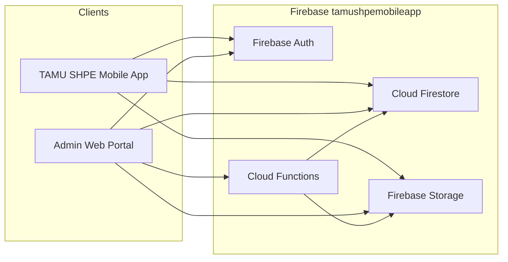
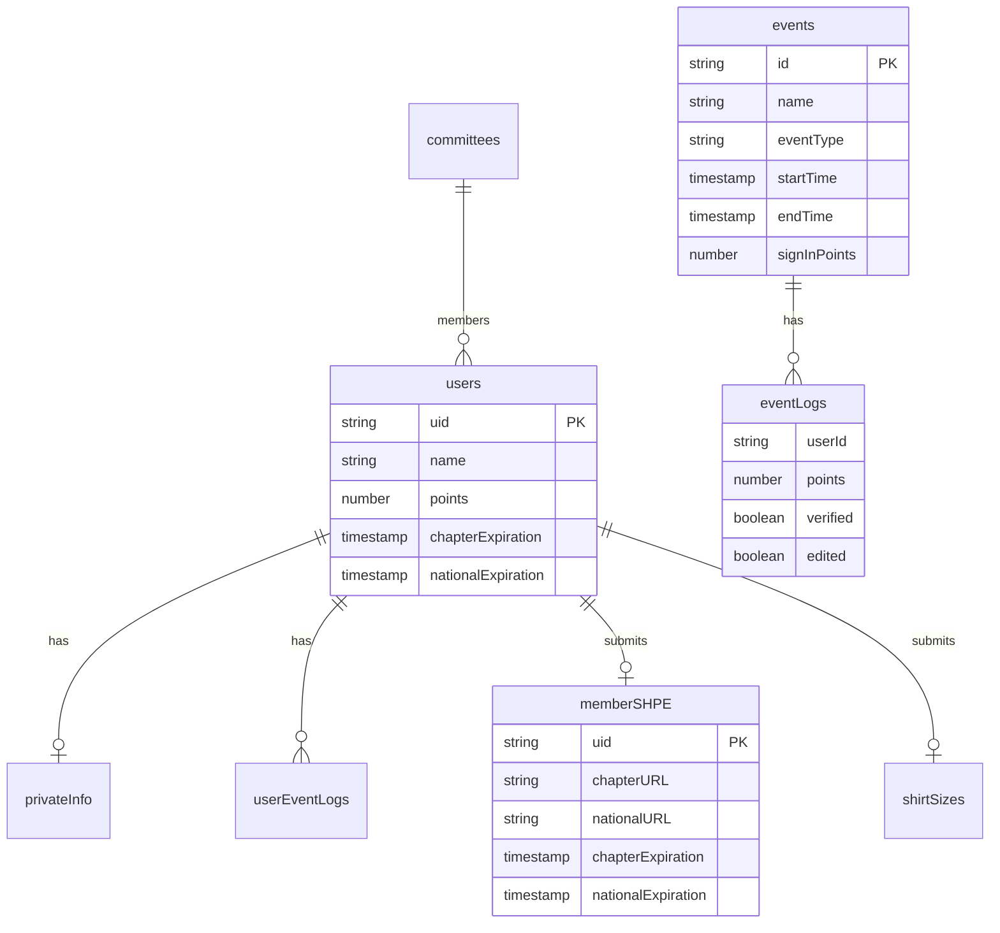
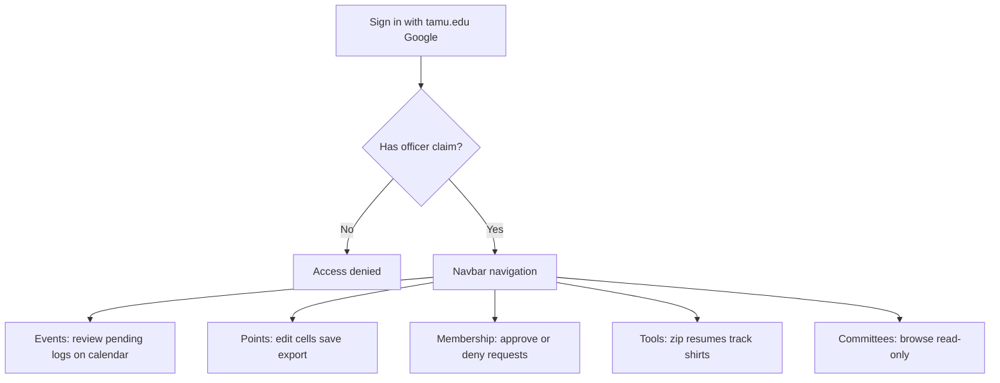

# TAMU SHPE Admin Web — Purpose & Functionality Breakdown

> **Note (rebuild, 2026):** this doc describes the portal's functionality as realized in the *original* client-side app, which has been removed from the repo; file citations (e.g. `firebaseUtils.ts`) are historical references to that codebase, not live paths. The rebuilt app (server-side writes via Hono, reads via TanStack Query hooks) lives at the repo root — see [REBUILD_CONCEPT.md](./REBUILD_CONCEPT.md) for its architecture. The *behavior* described here is the contract the rebuild implements, with one addition: the Dashboard is no longer an empty page (it now shows stat tiles, recent requests, and a points leaderboard).

## What This Repo Is

**`tamu-shpe-admin-web`** (`shpe-app-web` v0.1.0) is the **internal admin portal** for the Texas A&M SHPE (Society of Hispanic Professional Engineers) chapter. It is the web companion to the chapter mobile app and operates on the **same Firebase project** (`tamushpemobileapp`).

Officers and authorized staff use it to manage chapter operations that are too complex or sensitive for the mobile app UI alone: reviewing membership proofs, editing attendance points, browsing events, approving attendance logs, exporting data, and running batch tools (resume zip, shirt pickup).

It is **not** a public-facing website. Access is restricted to `@tamu.edu` Google accounts with Firebase custom claims.

---

## System Context



**Key design constraint:** Type definitions in [`app/types/`](../app/types/) and data helpers in `app/api/firebaseUtils.ts` are kept in sync with the mobile app codebase (`MobileApp/src/types/*`, `MobileApp/src/api/firebaseUtils.ts`). Changes here affect both platforms.

**Important architectural note:** Despite living under `app/api/`, `firebaseUtils.ts` is **not** a Next.js HTTP API layer. There are no `route.ts` handlers. All Firestore reads/writes happen **client-side in the browser** via the Firebase JS SDK. Security depends on Firebase Security Rules (not in this repo) and Auth custom claims.

---

## Tech Stack

| Layer | Technology |
|-------|------------|
| Framework | Next.js 14 (App Router) |
| UI | React 18, Tailwind CSS, react-icons |
| Language | TypeScript |
| Backend | Firebase Auth, Firestore, Storage, Cloud Functions |
| Utilities | date-fns, ExcelJS + file-saver (Excel export) |
| Hosting | Vercel (referenced in `cors.json`) |
| Path alias | `@/*` → `./app/*` |

---

## Authentication & Authorization

**Entry point:** `app/page.tsx` — login screen branded "TAMU SHPE Admin Site"

**Login flow** (`app/helpers/auth.ts`):

1. Google OAuth popup restricted to `@tamu.edu` (`hd: 'tamu.edu'`)
2. JWT custom claims checked: `admin`, `officer`, `developer`, `lead`, or `representative`
3. Missing role → sign out + access denied alert
4. Valid role → redirect to `/dashboard`

**Protected routes:** All pages under `app/(main)/`/) use `onAuthStateChanged` and redirect unauthenticated users to `/`.

**Two role systems exist:**

- **Firebase Auth custom claims** — gate access to the admin site (authoritative)
- **Firestore `PublicUserInfo.roles`** — UI display only in the mobile app; comments in `app/types/user.ts` explicitly say these do not control Firebase permissions

---

## Application Structure

```
app/
├── page.tsx                 # Login (/)
├── layout.tsx               # Root layout
├── (main)/layout.tsx        # Authenticated shell + Navbar
├── (main)/dashboard/        # Auth-guarded landing (empty stub)
├── (main)/events/           # Event calendar + pending approvals
├── (main)/points/           # Points spreadsheet + export
├── (main)/membership/       # Member verification workflows
├── (main)/committees/       # Committee directory
├── (main)/tools/            # Resume zip + shirt tracker link
├── components/              # Navbar, MemberCard, CommitteeCard
├── api/firebaseUtils.ts     # Client-side Firestore data layer
├── config/firebaseConfig.ts # Firebase initialization
├── helpers/                 # auth.ts, timeUtils.ts
└── types/                   # Shared domain models
```

**Navigation** (`app/components/Navbar.tsx`): Dashboard, Events, Points, Committees, Membership, Tools, Sign out — styled in Texas A&M maroon (`#500000`).

---

## Data Model (Firestore)



### Collections managed by this app

| Collection / Path | Purpose |
|-------------------|---------|
| `users/{uid}` | Public member profiles: name, major, points, roles, membership expirations |
| `users/{uid}/private/privateInfo` | Email, resume URL, push tokens, app settings |
| `users/{uid}/event-logs/{eventId}` | Per-user attendance mirror (points, sign-in/out, verified) |
| `events/{eventId}` | Event metadata: schedule, location, geofencing, point rules, type |
| `events/{eventId}/logs/{userId}` | Canonical per-event attendance logs |
| `memberSHPE/{uid}` | Pending membership verification (proof doc URLs, expirations, shirt size) |
| `shirt-sizes/{uid}` | Shirt size submissions and pickup status |
| `committees/{id}` | Committee name, color, logo, head, leads, member count |
| `resumes/status`, `resumes/data` | Resume zip generation job status and download URL |

### Dual-write pattern for attendance/points

When officers edit points (`updatePointsInFirebase`), the app batch-writes to **both**:

- `events/{eventId}/logs/{userId}` (canonical event log)
- `users/{uid}/event-logs/{eventId}` (user-centric mirror)

Edits set `edited: true` and `verified: true`. Aggregate totals on user docs are recalculated by the Cloud Function `updateAllUserPoints`.

### Event types (`app/types/events.ts`)

General Meeting, Committee Meeting, Study Hours, Workshop, Volunteer, Social, Intramural, Custom — each with fields for geofencing, point rules (sign-in, sign-out, per-hour), committee association, visibility flags, and workshop subtypes.

---

## Feature Modules (Detailed)

### 1. Dashboard (`/dashboard`) — Stub

`app/(main)/dashboard/page.tsx`/dashboard/page.tsx) only verifies auth and renders an empty page. It is the post-login landing but carries no analytics or summary widgets yet.

---

### 2. Events (`/events`) — Calendar & Attendance Review

**Purpose:** Visualize chapter events and surface events needing officer attention.

**Components:**

- `EventCalendar`, `MonthView`, `WeekView` — month/week calendar views
- `PendingEvent` — cards for events with **unverified** attendance logs
- `EventModal` — full-screen create/edit form with attendee log table
- `DayModal` — day-level event drill-down

**Data flow:**

1. `getEvents()` loads all events sorted by `startTime`
2. For each event, `getEventLogs()` checks for logs where `verified` is false
3. Events with unverified logs appear in "Pending Approval"

**Event creation/editing:** The form in `EventModal` collects name, dates/times, location, event type, point values, buffers, committee, etc. **However, `handleSubmit` currently only `console.log`s the payload** — it does not persist to Firestore. This is a known incomplete feature.

---

### 3. Points (`/points`) — Spreadsheet, Edit, Export

**Purpose:** Officer-facing points ledger for the SHPE school year (June–May).

**Capabilities:**

- **Total Points** view — cumulative member standings
- **Monthly Points** view — matrix of members × events per month, plus Instagram points columns
- **Inline editing** — officers change cell values, then save
- **Save** → `updatePointsInFirebase()` dual-writes to both log paths
- **Update Points** button → `updateAllUserPoints()` Cloud Function recalculates aggregate totals
- **Export to Excel** — client-side multi-sheet workbook (master + per-month) via ExcelJS
- **Officer highlighting** — members with officer roles shown in red
- **24-hour localStorage cache** for members/events with manual reload

This is one of the most complete and actively used modules.

---

### 4. Membership (`/membership`) — Verification Workflow

**Purpose:** Manage official SHPE membership status for chapter members.

**Three tabs:**

1. **Official Members** — users with valid chapter + national expiration dates (`isMemberVerified()`)
2. **Requests** — pending submissions from `memberSHPE` collection (requires both chapter and national proof URLs)
3. **All Users** — full roster with role display

**Approve flow:**

1. Update `users/{uid}` with expiration dates from the request
2. Delete `memberSHPE/{uid}` document
3. Call `sendNotificationMemberSHPE` Cloud Function with `'approved'`

**Deny flow:**

1. Clear expiration dates on user doc
2. Delete `memberSHPE/{uid}`
3. Notify member with `'denied'`

**Document review:** `MemberCard` downloads proof files from Firebase Storage URLs stored in the request.

Uses 24-hour localStorage cache for requests and members.

---

### 5. Committees (`/committees`) — Read-Only Directory

**Purpose:** Display chapter committees from Firestore.

- `getCommittees()` fetches committee metadata
- `CommitteeCard` shows logo, color, description, member count
- Committee head display has partial/stubbed logic (TODO in code)

Read-only in this admin app; committee management likely happens elsewhere.

---

### 6. Tools (`/tools`) — Operational Utilities

#### Resume Download

- Triggers `zipResume()` Cloud Function
- Real-time status via Firestore listeners on `resumes/status` and `resumes/data`
- Provides download link when generation completes

#### Shirt Tracker (`/tools/shirt-tracker`)

- Combines `getMembers()` + `getShirtsToVerify()` for enriched table (name, email, membership status, shirt size)
- Officers toggle pickup checkbox → updates `shirt-sizes/{uid}` in Firestore

#### Instagram Points (`/tools/instagram-points`)

- Port of the mobile app's "Instagram Points" admin screen (Wear It Wednesday): officers multi-select members who posted SHPE gear on Instagram and award each +1 point
- Awards go through `POST /api/instagram/award` — one atomic batch dual-writing `events/{eventId}/logs/{uid}` and `users/{uid}/event-logs/{eventId}`, appending a `Timestamp` to `instagramLogs` (byte-compatible with the mobile `addInstagramPoints` callable, so both clients coexist)
- The hidden "Instagram Points" event is looked up by name and lazily created server-side on first award
- History table reads client-side: event logs joined to `users/{uid}` — awards count, points, last-awarded date, membership status

---

## Cloud Functions (External to Repo)

These run in the Firebase backend, invoked via `httpsCallable`:

| Function | Triggered From | Purpose |
|----------|----------------|---------|
| `updateAllUserPoints` | Points page | Recalculate aggregate point totals on user docs |
| `sendNotificationMemberSHPE` | Membership approve/deny | Push notification to member's mobile app |
| `zipResume` | Tools page | Bundle member resumes into downloadable zip |

---

## Caching Strategy

Several heavy pages cache Firestore results in **`localStorage`** for 24 hours:

- Points: members + events
- Membership: members + verification requests

Manual reload buttons bypass cache. This reduces Firestore reads but can show stale data until refresh.

---

## User Journeys



**Typical officer session:**

1. Sign in → empty dashboard
2. Check **Membership → Requests** for new verification submissions
3. Review **Events → Pending Approval** for unverified attendance
4. Adjust **Points** in monthly view, save, optionally run Update Points or export Excel
5. Use **Tools** for semester-end resume collection or shirt pickup tracking

---

## Current Limitations / WIP

| Area | Status |
|------|--------|
| Dashboard | Empty placeholder — no summary widgets |
| Event create/edit | Form UI complete; submit does not write to Firestore |
| Pending event approval | Display exists; bulk approve action incomplete |
| Committee heads | Partially stubbed |
| Security rules | Not in repo — assumed configured in Firebase console |
| Server-side API | None — all data access is client-side |

---

## What This Repo Is NOT

- Not the mobile app (companion only)
- Not the Firebase Cloud Functions source
- Not a public member portal
- Not a standalone backend — no REST/GraphQL server, no database of its own

---

## Summary

**Purpose:** Give TAMU SHPE officers a browser-based control panel over the chapter's shared Firebase data — the operational backbone behind the mobile app.

**Core functionality:**

1. **Gate access** to authorized `@tamu.edu` officers via Firebase Auth claims
2. **Manage membership** verification (approve/deny with notifications)
3. **Track and edit points** across events with dual-write consistency and Excel export
4. **Review events and attendance** via calendar and pending-approval views
5. **Browse committees** as a read-only directory
6. **Run batch tools** for resume collection and shirt pickup tracking

The app is a **thin admin UI layer** over a shared Firebase backend, with its heaviest logic living in Cloud Functions and its data contracts shared with the mobile app.
